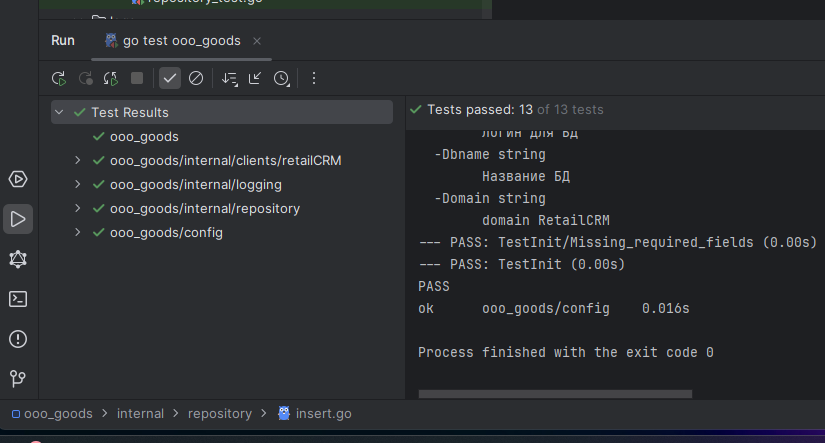

# Тестовое задание для ООО Goods
Тестовое задание на позицию php/Golang разработчика.
С интеграциями RetailCRM.
## Конфигурация
Для запуска приложения обязательно требуется указать несколько обязательных аттрибутов: 
* Домен в системе
* API - ключ
* База данных. Хост
* База данных. Схема
* База данных. Логин
* База данных. Пароль
Конфигурация собирается по следующей приоритетности:
1. Флаги ``-Apikey``, ``-Domain``, ``-Dbhost``, ``-Dbname``, ``-Dblogin`` и ``-DbPass``.
2. Переменные окружения ``Apikey``, ``Domain``, ``Dbhost``, ``-Dbname``, ``Dblogin`` и ``bPass``.
3. Файл ``config.yaml``. (Файл прописан в ``.gitignore``, однако Вы можете переименовать ``config-test.yaml``, заменив данные).

## Миграции
Написан собственный модуль миграции, под конкретный проект.
При первом запуске, проверяется папка migration, ищется файл с суффиксом ``*.up.sql``. Запускается выполнение sql-скрипта. 
Имя файла записывается в конфигурацию, как имя таблицы.

## Логирование
При первом запуске, создается файл (и папка) ``logs/info.log``, в который записывается stdOut приложения.
Используемая библиотека логирования ``uber/zap```

## Тесты 
Плотность покрытия тестами 83.96%. Тесты написаны для всех используемых файлов, кроме main.go (и моделей).



### Тестовая БД
Для проверки работы приложения с БД создал файл 🐳``docker-compose.yaml``. Он поднимает тестовую базу данных mysql@8.0, 
к которой подключалось приложение.

## Данные
Для выполнения тестового задания нанимающая компания предоставила четкое ТЗ. 
- Драйвер базы данных mysql. Тк версия не указана, использовал запросы под часто используемую 7.1.
- Домен CRM-системы и API ключ.
- Данные для входа в Базу данных.
- Поля, которые требуется извлекать из REST-API, а затем сохранять в базу.

### Возникшие проблемы и Ответы на несовпадения данных.
В **json-ответе** на запрос возникли непонятные моменты:

1. В т.н. *Произвольных полях* (custom_fields/Кастомные поля) <u>отсутствует поле</u> ``podtverzden_otpravka``. <br> 
**ОТВЕТ.** В задании четко указано, какие поля требуется брать из ответа. Тк такого поля нет, но может появиться, 
я сохраняю в значения **NULL**
2. В ответе есть массив с платежами. ID платежа уникальное, сумма совпадает с суммой заказа. Однако все равно вывожу пустое значение.<br>
**ОТВЕТ.** В задании указано, какое поле брать и оно существует. 
Кроме того в <a href="https://docs.retailcrm.ru/Developers/API/APIVersions/APIv5#get--api-v5-orders" target="_blank">документации эндпоинта</a>
указано, что данное поле как раз является оплаченной суммой.
3. При запросе запрашиваю 20 элементов, хотя есть возможность запросить 100. Разве это не быстрее?<br>
**ОТВЕТ.** На одном потоке, да - быстрее. Однако Golang имеет возможность запускать легковесные параллельные процессы 
на разных потоках (логических ядрах процессора). Таким образом, каждые запросы (в CRM и в базу) выполняются и обрабатывается параллельно. 
На PHP Я бы параллельность реализовал через функцию <a href="https://www.php.net/manual/ru/function.exec.php" target="_blank">exec()</a>
4. **ЛИШНИЙ КОД!** Тестовых данных всего 143 штуки, 8 страниц. До 9 страницы не дойдет, зачем пауза?<br>
**ОТВЕТ.** Да, но данных может быть и больше. Согласно документации (https://docs.retailcrm.ru/Developers/API/APIFeatures/APIRules#h-5), частота обращения не должна превышать 10 запросов в секунду.
   Для этого я после отправляю каждые 10 запросов с паузой в 1 сек.


### Пояснения.
* Golang - строгой типизации, и у простых типов данных есть zero-value. 
Однако при пустых значениях в текстовые поля вставляю NULL, а во float - нули. Это связано с тем, что разница скорости выполнения 
проверки на NULL и на ноль около 7-8%. Готов продемонстрировать выполнение EXPLAIN. 
* При запросе запрашиваю 20 элементов, хотя есть возможность сразу запросить 100. 
* Context не использую специально, тк это вызвало бы лишнее потребление памяти. Было бы отправлено, множество запросов на различные страницы, 
 которые хранились бы в стеке netpooler-а. <br>
Кроме того, большинство ответов были бы условно пустые, а ``статус-код 200`` (как и при успешном выполнении). Для сравнения, у АМО пустой ответ всего 2 символа и ``статус-код 204``.

## Исполняемые файлы.
Приложение скомпилировано (собрано из исходников, в исполняемые файлы) в папку ``bin``, под большинство ОС.
Для запуска требуется:
1. Поместить рядом с исполняемым файлом папку *migration*. 
2. Скопировать рядом файл _config.yaml.example_, переименовать в _config.yaml_.
3. Открыть это файл любым текстовым редактором, заменить значения на реальные.
4. Для ОС Linux прописать chmod бинарнику. Пояснение: тк приложение читает файлы конфигурации и миграции, а также создает папку и файл для логов, то ему нужны разрешения на данные операции с файловой системой.
5. Запустить бинарный файл.
